# Med Doctor Assignment Service

Сервис автоматически назначает визитам из очереди **«врач не назначен»** врача, который только что занял рабочее место в
QMatic Orchestra 6, и переводит такие визиты в очередь соответствующей услуги. Решение ориентировано на сценарий **автономных медосмотров**, где критично быстро раздать визиты по реальным врачам без ручного вмешательства оператора.

## 1. Для чего нужен сервис

Типовой поток работы выглядит так:

1. Врач входит на service point.
2. Orchestra публикует связанный набор событий посадки: `USER_SERVICE_POINT_SESSION_START`, затем `SET_WORK_PROFILE`.
   Сервис коррелирует их по `staffTransactionId` и формирует внутренний триггер `USER_SESSION_READY`.
   `SERVICE_POINT_OPEN` используется только как вспомогательный/диагностический сигнал и в боевой рабочий процесс по умолчанию
   не запускает мутации.
3. Сервис определяет branch, service point, врача и его work profile.
4. По кэшу справочников определяет, какие услуги врач может обслуживать.
5. Берет визиты из очереди «врач не назначен».
6. Анализирует непройденные услуги визита.
7. Выбирает лучшую услугу для этого врача.
8. Если нужная услуга уже назначена визиту, сразу переводит его в очередь услуги (`transfer-only`).
9. Если услуга ещё не назначена, выполняет `assign-service`, а затем `transfer-visit`.

Сервис проектировался так, чтобы:

- не зависеть от GUI Orchestra;
- выдерживать повторные события и временные сетевые сбои;
- продолжать работу даже при отказе websocket-канала за счет страхующего опроса по расписанию;
- не принимать решение на основе «живых» справочников при каждом событии, а работать через локальный кэш отделения (`BranchAssignmentCache`).

## 2. Что входит в проект

### 2.1. Технологический стек

- Java 8
- Micronaut 3.5.2
- Maven
- Micronaut HTTP Client / Netty server
- Spring SockJS/STOMP client для подписки на события Orchestra
- Jackson для сериализации JSON

### 2.2. Структура пакетов

```text
src/main/java/com/qsystems/meddoctorassignment
├── adapter
│   ├── gateway            # абстракции интеграции
│   ├── gateway/impl       # REST-реализации gateway-слоя
│   ├── orchestra          # Micronaut client + вспомогательные утилиты
│   └── orchestra/dto      # DTO Orchestra
├── branchgetter           # стратегии выбора branch id для кэширования
├── cache                  # контейнер кэшей и пересборка кэша отделения
├── cache/model            # модели кэша
├── cache/service          # сервис управления жизненным циклом кэша
├── config                 # конфигурационные свойства
├── domain/model           # доменные модели визита и выбора услуги
├── domain/service         # доменные интерфейсы и оркестратор алгоритма
├── domain/service/impl    # реализации доменных интерфейсов
├── event                  # обработка входящих событий Orchestra
├── model/event            # нормализованное представление входящих событий
├── schedule               # страхующий опрос по расписанию
├── util                   # технические утилиты устойчивости
└── websocket              # SockJS/STOMP клиент и разбор фреймов
```

### 2.3. JavaDoc-покрытие доменного контура

Для ключевых точек алгоритма назначения поддерживается расширенный JavaDoc на уровне интерфейсов и реализаций:

- `domain/service/DoctorServiceSelectionService` — контракт выбора услуги врача с локальным и med-robot сценарием;
- `domain/service/VisitAssignmentExecutor` — контракт mutation-этапа (`assign-service` + `transfer-visit`);
- `domain/service/impl/DefaultVisitAssignmentExecutor` — детализация `transfer-only`, recheck и post-check поведения.

Это помогает быстрее разбирать код при сопровождении и снижает порог входа для новых разработчиков без чтения всех интеграционных классов.

## 3. Архитектура решения

### 3.0. Диаграммы проекта

Ниже добавлены диаграммы в двух видах. Видимые SVG-файлы оформлены в едином business/UML-стиле: используются профильные UML-элементы, ровная сетка, прозрачные подписи стрелок без белых подложек, шрифт Segoe UI без засечек, выровненные связи и ручные переносы длинных технических подписей. Диаграммы рассчитаны на чтение прямо из Markdown без внешних плагинов и без потери русских подписей:

- исходники PlantUML: `docs/plantuml/*.puml`;
- заранее подготовленные SVG: `docs/diagrams/*.svg`.

Принятые правила оформления:

- для структурных схем используются UML-подобные `component`, `package`, `class`, `node`, `artifact` и `interface`;
- для последовательностей используются выровненные lifeline-блоки, отдельные `alt`/`loop`-рамки и укороченные подписи стрелок;
- длинные технические подписи вынесены в отдельные строки или примечания, чтобы не перекрывать стрелки и элементы;
- программные имена классов сохранены только там, где они помогают быстро перейти от документации к исходному коду.

Это позволяет:

- читать архитектуру прямо в `README.md` без внешних плагинов;
- редактировать диаграммы как код;
- использовать SVG в документации, wiki и при внедрении;
- сохранять русскоязычные пояснения, оставляя программные имена только там, где нужно быстро сопоставить диаграмму с кодом.

#### Общая архитектура сервиса


Исходник: `docs/plantuml/architecture-overview.puml`

#### Диаграмма пакетов и направлений зависимостей

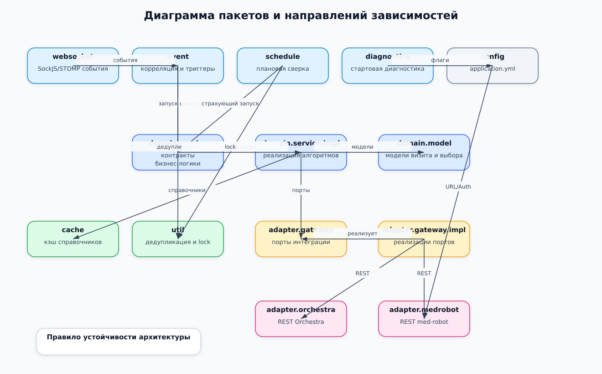

Исходник: `docs/plantuml/package-dependency-map.puml`

#### Диаграмма классов доменного контура назначения

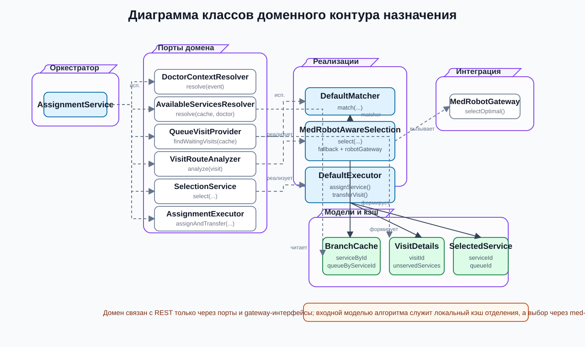

Исходник: `docs/plantuml/domain-class-diagram.puml`

#### Последовательность назначения визита врачу


Исходник: `docs/plantuml/assignment-sequence.puml`

#### Подробная последовательность выбора через med-robot

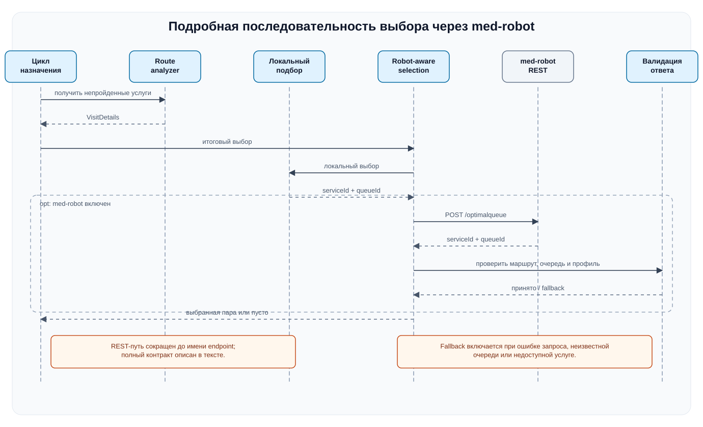

Исходник: `docs/plantuml/med-robot-selection-sequence.puml`

#### Пересборка кэша отделения


Исходник: `docs/plantuml/cache-refresh-sequence.puml`

#### Последовательность плановой reconciliation-обработки

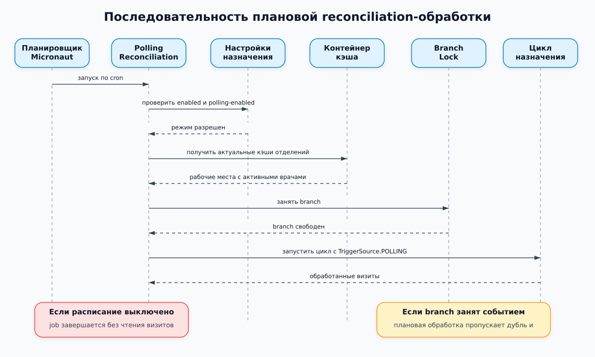

Исходник: `docs/plantuml/polling-reconciliation-sequence.puml`

#### Схема внедрения и эксплуатации


Исходник: `docs/plantuml/deployment-view.puml`

#### Процесс работы по зонам ответственности

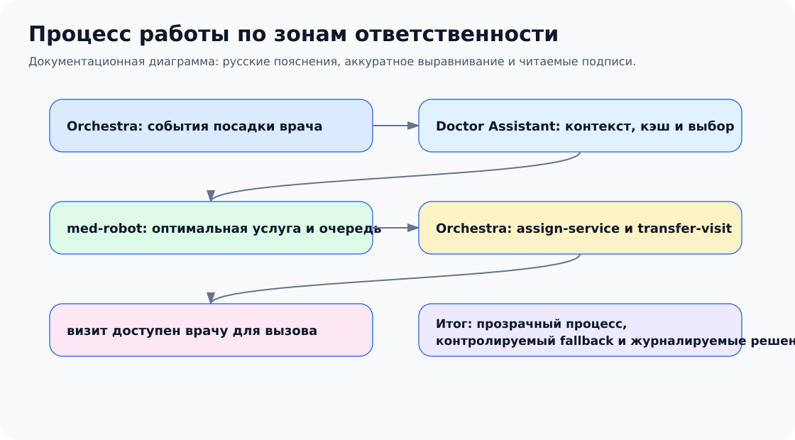

Исходник: `docs/plantuml/orchestration-swimlane.puml`

#### Состояния визита при автоматическом назначении

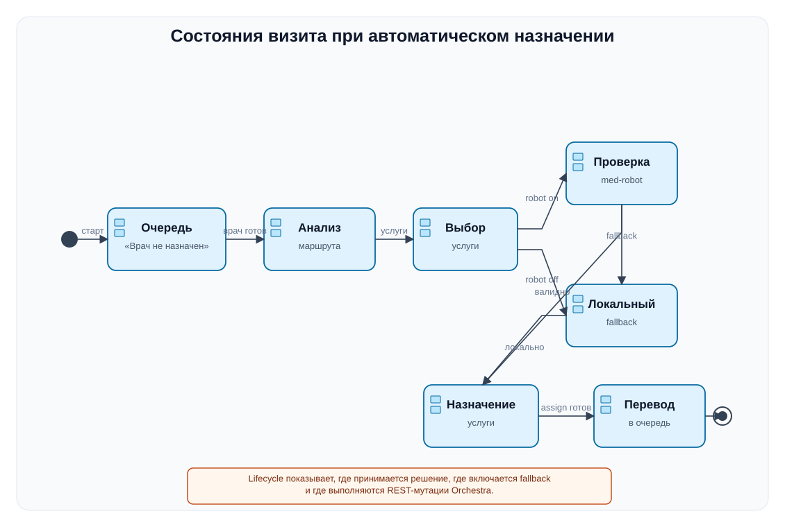

Исходник: `docs/plantuml/visit-lifecycle-state.puml`

#### Дерево решений med-robot и локального fallback

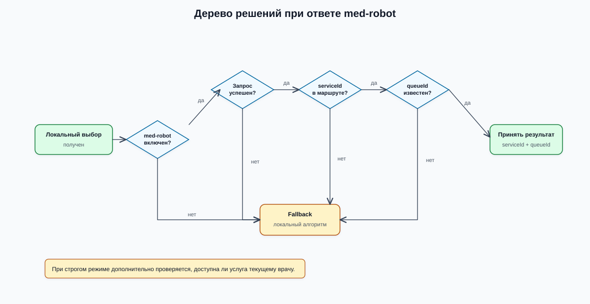

Исходник: `docs/plantuml/med-robot-fallback-decision.puml`

#### Карта режимов запуска обработки

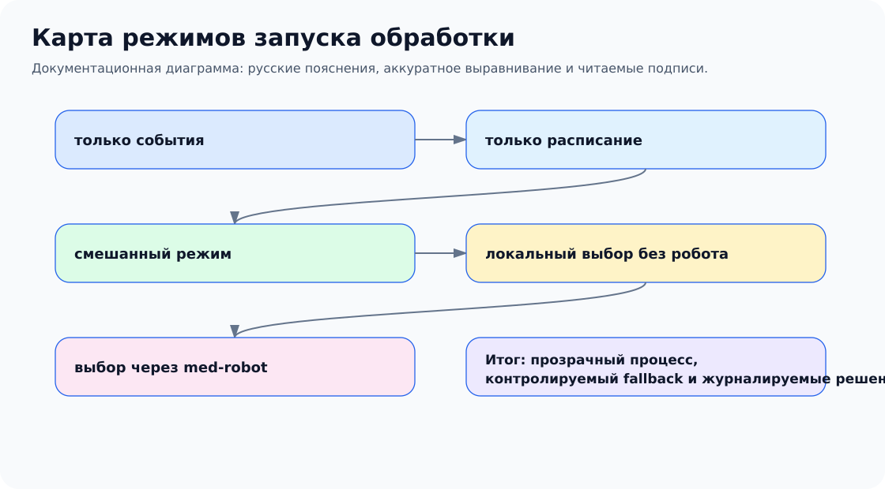

Исходник: `docs/plantuml/operation-modes-map.puml`

#### Карта данных и REST-контракта med-robot

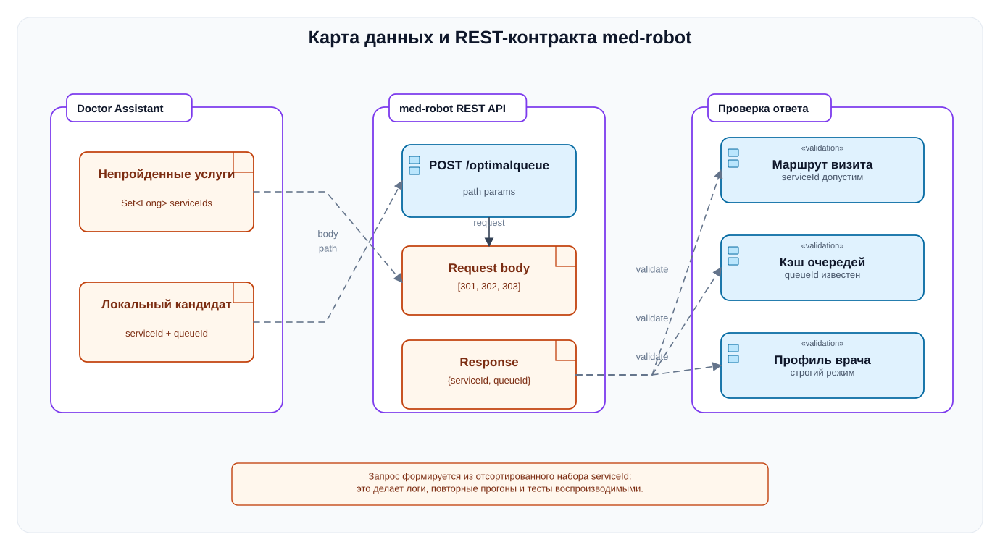

Исходник: `docs/plantuml/data-contract-map.puml`

#### Отказы и восстановление без остановки цикла

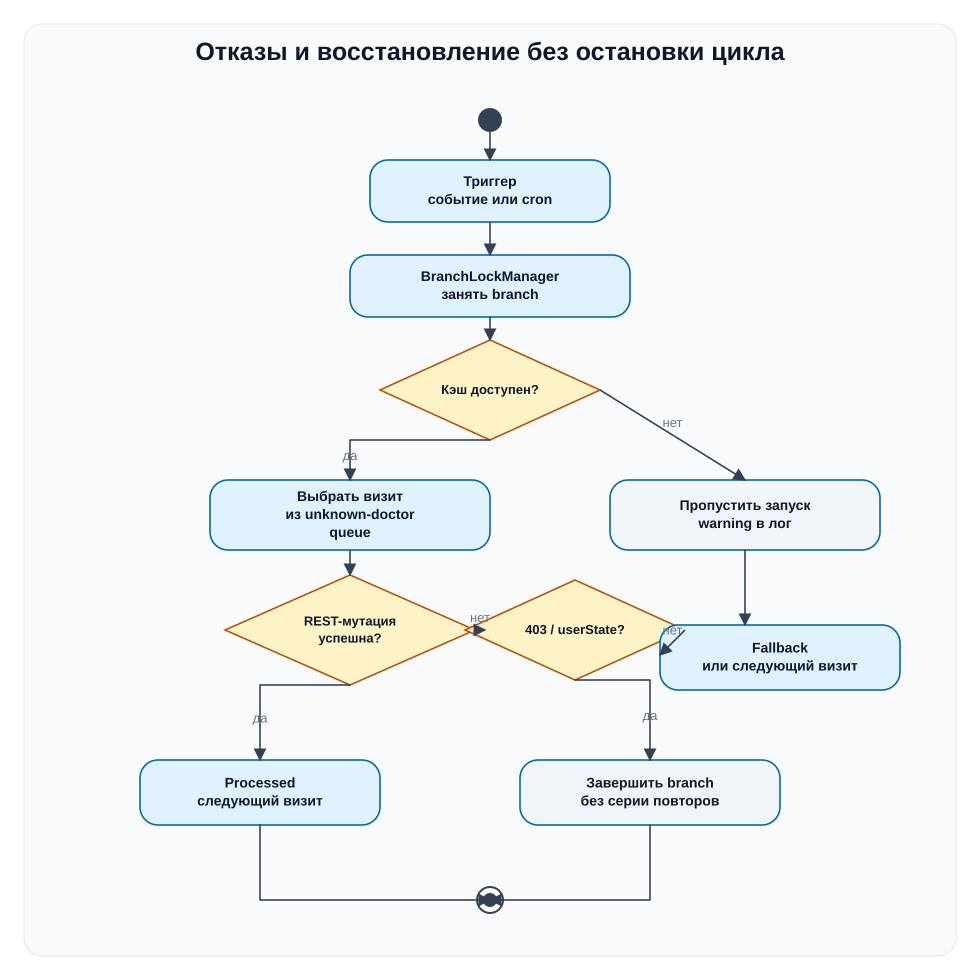

Исходник: `docs/plantuml/failure-recovery-flow.puml`

#### REST-мутации Orchestra при назначении визита

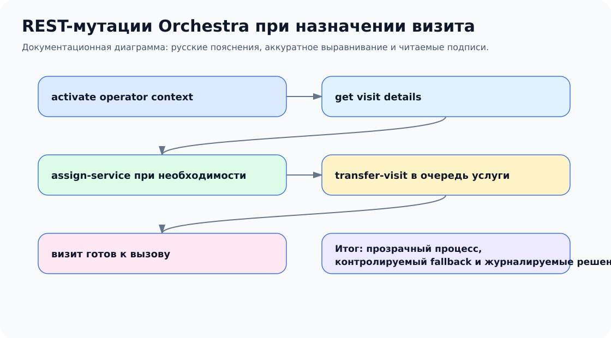

Исходник: `docs/plantuml/rest-mutation-flow.puml`

#### Наблюдаемость и эксплуатационная проверка

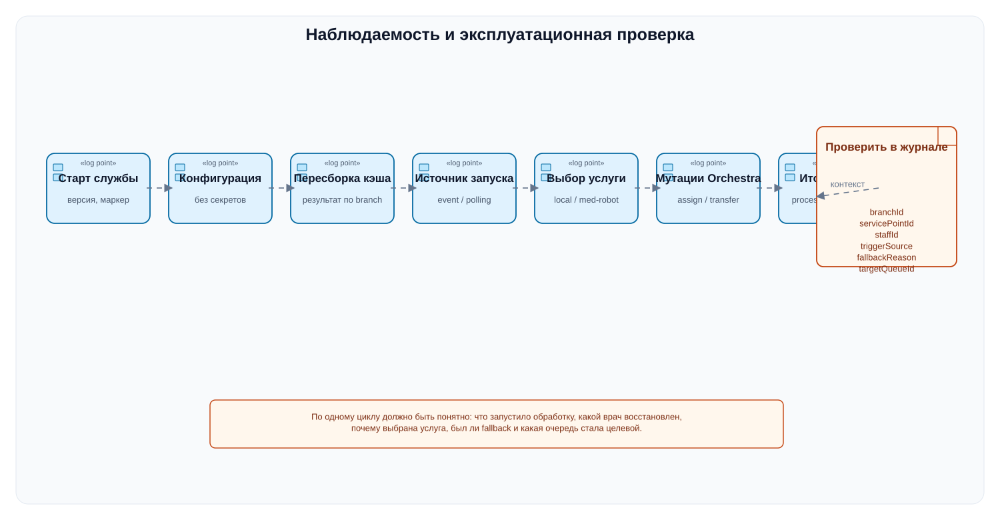

Исходник: `docs/plantuml/observability-checklist.puml`

### 3.1. Слой адаптеров

`OrchestraMetadataGateway` и `OrchestraMetadataGatewayImpl` отвечают за чтение справочных сущностей Orchestra:

- отделения;
- услуги;
- очереди;
- рабочие профили;
- точки обслуживания.

`VisitWorkflowGateway` отделен от чтения справочников, потому что операции над визитами в Orchestra часто зависят от
конкретной инсталляции и набора доступных REST-точек. Для этого в проекте есть `ConfigurableVisitWorkflowGateway`,
который читает пути из `application.yml`.

### 3.2. Слой локального кэша

`BranchAssignmentCache` — центральная модель, в которой для одного отделения собирается весь справочный срез, нужный
алгоритму.

Кэш содержит:

- `serviceId -> ServiceData`
- `serviceId -> queueId`
- `queueId -> serviceIds`
- `workProfileId -> queueIds`
- `servicePointId -> runtime state`
- `serviceExternalKey -> serviceId`
- `unknownDoctorQueueId`
- `lastUpdated`

`BranchCacheUpdater` строит новый экземпляр кэша отделения полностью, а затем `OrchestraDataCacheContainer` атомарно
подменяет старый. Это важно для того, чтобы обработчик событий никогда не читал «полусобранный» кэш.

### 3.3. Событийный слой

`WebSocketService` поднимает SockJS/STOMP подключение к Orchestra.

`StompSessionHandlerImpl` подписывается на события:

- `USER_SERVICE_POINT_SESSION_START`
- `SERVICE_POINT_OPEN`
- `SET_WORK_PROFILE`

`WebsocketFrameHandler` превращает сырой JSON в `OrchestraEvent`, а `DoctorAssignmentEventHandler` строит небольшую
state machine вокруг посадки врача:

1. `USER_SERVICE_POINT_SESSION_START` регистрирует pending-session;
2. следующий `SET_WORK_PROFILE` с тем же `staffTransactionId` завершает корреляцию;
3. сервис формирует внутренний триггер `USER_SESSION_READY`;
4. только после этого восстанавливает `DoctorContext` и запускает доменный цикл назначения;
5. если во время активной сессии приходит `SET_WORK_PROFILE`, который расширяет доступный набор услуг врача, сервис
   может сформировать триггер `WORK_PROFILE_EXPANDED` и повторно обработать очередь «врач не назначен».

### 3.4. Доменный слой

`AutonomousMedicalExamAssignmentService` — главный оркестратор алгоритма.

Он использует следующие расширяемые доменные абстракции:

- `LoggedDoctorContextResolver`
- `DoctorAvailableServicesResolver`
- `UnknownDoctorQueueVisitProvider`
- `VisitRouteAnalyzer`
- `DoctorServiceMatcher`
- `VisitAssignmentExecutor`

Благодаря этому бизнес-алгоритм можно дорабатывать локально, не переписывая websocket и кэширование.

### 3.5. Слой устойчивости

Для устойчивой работы добавлены:

- `BranchLockManager` — не допускает конкурентную обработку одного branch несколькими потоками;
- `EventDeduplicator` — подавляет повторы событий Orchestra;
- `ProcessedVisitRegistry` — предотвращает повторную обработку одного и того же маршрутного шага визита в коротком окне времени; ключ учитывает `visitId`, врача и fingerprint текущего шага, а при наличии `currentVisitService.id` использует именно его;
- `PollingReconciliationJob` — периодический страхующий запуск, если событие было потеряно или пришло в неудачный момент;
- `OrchestraDataCacheUpdateService` — отказоустойчивый bootstrap и refresh branch cache: при недоступности Orchestra не роняет процесс, а сохраняет сервис в рабочем состоянии и планирует повторную попытку подключения/прогрева кэша.

## 4. Алгоритм назначения

### 4.1. Восстановление контекста врача

`DefaultLoggedDoctorContextResolver` сначала берет поля напрямую из event payload:

- `branchId`
- `servicePointId`
- `staffId` или `userId`
- `workProfileOrigId` или `workProfile`
- `workProfileName`
- `servicePointName`
- `userName` / `user`

Если часть полей отсутствует, включается безопасный поиск недостающих данных:

1. поиск по `servicePointId` в runtime cache branch;
2. поиск через `ServicePointContextGateway`;
3. поиск по `staffId` в runtime cache branch;
4. поиск по `staffId` через Orchestra.

Если после этого ключевые поля не заполнены, обработка события завершается исключением — это правильное поведение,
потому что сервис не должен делать догадки в критическом рабочем процессе.

### 4.2. Определение доступных услуг врача

`DefaultDoctorAvailableServicesResolver` проходит по связке:

`workProfile -> queues -> services`

Итогом является множество `serviceId`, которые допустимы для текущего врача в рамках его текущего рабочего профиля.

### 4.3. Выбор услуги визита

`DefaultDoctorServiceMatcher` смотрит на `VisitDetails.unservedServices` и строит список кандидатов.

Правила выбора:

1. сначала учитывается `routeOrder` — приоритет имеет услуга, которая раньше стоит в маршруте визита;
2. если маршрут не задает явного преимущества, используется `service-priority-by-key` из конфигурации;
3. если и этого нет, применяется детерминированный резервный выбор по `serviceId`.

Такая схема дает одновременно:

- предсказуемость;
- возможность ручной подстройки приоритетов;
- отсутствие случайного выбора.

### 4.4. Исполнение решения

`DefaultVisitAssignmentExecutor` делает ветвящийся рабочий процесс:

1. optional recheck — все ли еще визит находится в очереди «врач не назначен»;
2. если `currentVisitService` уже совпадает с выбранной услугой врача, executor пропускает redundant `assign-service` и
   идет сразу в `transfer-only`;
3. если услуга ещё не совпадает, выполняет `assignServiceToVisit(...)`;
4. затем выполняет `transferVisitToQueue(...)`;
5. optional post-check — действительно ли визит оказался в ожидаемой очереди.

Перед началом цикла `AutonomousMedicalExamAssignmentService` теперь также умеет вызывать
опциональный шаг активации (`activation-step`) (`OperatorContextActivationGateway`). Он нужен для тех инсталляций,
где между событием «врач сел на рабочее место» и mutating REST необходим отдельный вызов,
запускающий или привязывающий server-side session service point / operator context.

При `dry-run=true` сервис только пишет в лог, какие действия он бы выполнил.

Важно: по проверенным логам Orchestra ответ `assign-service` может возвращать `userState=INACTIVE`, но при этом уже
фактически менять `currentVisitService` визита. Поэтому текущая реализация считает `assign` **эффективно успешным**,
если HTTP-статус равен `200`, а в response body уже видно, что `currentVisitService.serviceId` совпал с запрошенной
услугой. В этом случае сервис не abort-ит цикл и сразу продолжает `transfer`.

### 4.5. Повторное возвращение визита в «Врач не в системе»

Для автономных медосмотров нормально, что один и тот же `visitId` после прохождения очередной услуги снова возвращается в служебную очередь **«Врач не в системе»**. При этом текущая услуга снова может быть `currentVisitService.serviceId=117`, но это уже новый маршрутный шаг.

Чтобы не заблокировать такой легитимный повтор, защита `ProcessedVisitRegistry` работает по fingerprint маршрутного шага:

1. если Orchestra вернула `currentVisitService.id`, используется `currentVisitServiceRecordId=<id>`;
2. если `currentVisitService.id` отсутствует, используется fallback по `currentServiceId`, `queueId` и `unservedServices`.

Пример: если визит `30354` уже был обработан на шаге `currentVisitService.id=227634`, повторный polling того же шага будет пропущен. Если после следующей услуги визит снова оказался в `117`, но Orchestra выдала новый `currentVisitService.id`, сервис снова может обратиться к med-robot за следующей услугой.

Диагностический лог дубля:

```text
Visit 30354 already processed recently for doctor 1 processingFingerprint=currentVisitServiceRecordId=227634
```

## 5. Подтвержденные и неподтвержденные API

### 5.1. Подтвержденные REST-точки

В проекте как подтвержденные используются:

- `/qsystem/rest/config/branches`
- `/rest/servicepoint/branches/{branchId}/services`
- `/rest/entrypoint/branches/{branchId}/services/{serviceId}/queue`
- `/rest/managementinformation/v2/branches/{branchId}/servicePoints`
- `/rest/servicepoint/branches/{branchId}/workProfiles`
- `/rest/servicepoint/branches/{branchId}/workProfiles/{workProfileId}/queues`
- `/rest/servicepoint/branches/{branchId}/queues/`

### 5.2. Конфигурируемые REST-точки рабочего процесса визита

Кроме REST-точек assign/transfer проект теперь поддерживает и **отдельный шаг активации (`activation-step`)**.
Он задается через `application.assignment.activation.*` и по умолчанию выключен, потому что
точный контракт REST-вызова активации зависит от конкретной инсталляции Orchestra.

Поддерживаются placeholders:

- `{branchId}`
- `{servicePointId}`
- `{staffId}`
- `{workProfileId}`
- `{servicePointName}`
- `{workProfileName}`
- `{userName}`

Типовой сценарий включения выглядит так:

1. снять HTTP-трассу штатного UI Orchestra в момент «посадки» врача;
2. определить точный REST-вызов, который переводит operator/session context в активное состояние;
3. прописать его путь, метод и payload-template в `application.yml`;
4. включить `application.assignment.activation.enabled=true`.

Пути для операций над визитами задаются в `application.assignment.experimental-endpoints`:

- `queue-visits-path`
- `visit-details-path`
- `visit-by-id-path`
- `assign-service-path`
- `transfer-visit-path`

Это сделано намеренно: код не должен «угадывать» приватные REST-точки Orchestra.

## 6. Конфигурация

Главный файл конфигурации — `src/main/resources/application.yml`.

### 6.1. Блок `application.orchestra`

Используется для:

- базового URL Orchestra;
- логина и пароля;
- base-path для REST;
- выбора отделений, для которых нужно строить кэш;
- политики повторного подключения к Orchestra REST, если на старте или во время работы связь отсутствует.

Практически важный параметр:

- `reconnect-delay-ms` — задержка перед повторной попыткой bootstrap/refresh branch cache. Если Orchestra временно недоступна, сервис **не завершается аварийно**, а пишет проблему в лог и через этот интервал пытается подключиться снова.

### 6.2. Блок `application.websocket`

Управляет event-driven интеграцией:

- включение / отключение websocket-подписки;
- STOMP topic;
- список событий;
- задержка переподключения.

### 6.3. Блок `application.assignment`

Управляет самим алгоритмом:

- включение сервиса;
- queue id очереди «врач не назначен»;
- ограничение визитов на цикл;
- cron-выражение для опроса по расписанию;
- deduplication и processed TTL;
- режим `dry-run`;
- recheck перед переводом;
- список разрешенных branch;
- конфигурируемые приоритеты услуг;
- пути для REST-точек рабочего процесса визита;
- TTL защиты от повторной обработки именно маршрутного шага визита, а не всего `visitId`;
- составной триггер посадки (`user-service-point-session-start-trigger-enabled`, `user-session-settle-window-ms`);
- триггер расширения профиля (`work-profile-expanded-trigger-enabled`);
- правила раннего завершения цикла при контекстных ошибках mutation;
- настройки optional шаг активации (`activation-step`) перед mutating REST.

Практически важные флаги:

- `user-service-point-session-start-trigger-enabled` — основной безопасный триггер посадки;
- `set-work-profile-trigger-enabled` — сырой триггер для `SET_WORK_PROFILE`, обычно выключен;
- `work-profile-expanded-trigger-enabled` — повторный запуск цикла, когда новый профиль дал врачу больше услуг;
- `abort-cycle-on-forbidden-mutation` — не долбить Orchestra повторными PUT после первого контекстного отказа;
- `treat-inactive-user-state-as-failure` / `treat-no-started-service-point-session-as-failure` — как интерпретировать
  server-side user state в ответах `assign-service`.

### 6.4. Блок `application.med-robot`

Управляет опциональной интеграцией с внешним сервисом `med-robot`:

- `enabled=false` — полностью старая схема выбора услуги без обращения к роботу;
- `enabled=true` — Doctor Assistant вызывает `POST /prorobot/optimalqueue/{branchId}/service/{serviceId}` и получает от med-robot пару `serviceId`/`queueId`;
- `request-body-mode=UNSERVED_SERVICE_IDS_JSON_ARRAY` — в тело передается JSON-массив непройденных услуг, режим требует локального предварительного выбора;
- `request-body-mode=TICKET_NUMBER_PLAIN_TEXT` — в тело передается номер талона, режим позволяет вызывать med-robot даже при пустом `unservedVisitServices`, если у визита есть `ticketId` и `currentVisitService.serviceId`;
- `plain-text-policy=default` — query-параметр `policy` для plain text endpoint-а;
- `error-handling-mode=FALLBACK_TO_LOCAL` — при сетевой/HTTP-ошибке med-robot использовать локальный выбор, если он есть;
- `error-handling-mode=SKIP_VISIT` — при ошибке med-robot пропустить визит в текущем цикле;
- `fallback-to-local-on-empty-response=true` — ответ `null/null`, `0/0` или невалидная пара service/queue не блокирует назначение, если локальная схема смогла выбрать услугу;
- `require-known-queue=true` — очередь из ответа med-robot должна быть известна кэшу отделения;
- `require-doctor-available-service=false` — рекомендуемый режим для доверия robot-выбору в масштабе отделения.

Для сценария, где визит находится в очереди **«Врач не в системе»**, а `currentVisitService.serviceId=117`, рекомендуемый режим:

```yaml
application:
  med-robot:
    enabled: true
    url: http://med-robot:8082
    optimal-service-path: /prorobot/optimalqueue/{branchId}/service/{serviceId}
    request-body-mode: TICKET_NUMBER_PLAIN_TEXT
    plain-text-policy: default
    error-handling-mode: FALLBACK_TO_LOCAL
    fallback-to-local-on-empty-response: true
    require-known-queue: true
    require-doctor-available-service: false
  websocket:
    enabled: false
  assignment:
    polling-enabled: true
    polling-cron: "0 */10 * * * ?"
```

В этом случае ожидаемый запрос к med-robot выглядит как `POST /prorobot/optimalqueue/1/service/117?policy=default` с телом `Р002` и заголовками `Content-Type: text/plain`, `Accept: application/json`.

Подробный контракт, матрица fallback и диагностика причин, по которым робот может не вызываться, описаны в `MED_ROBOT_INTEGRATION.md` и `RUNBOOK.md`.


## 7. Документация по ролям и тестовому стенду

Для передачи проекта разным участникам подготовлены отдельные прикладные документы:

| Документ | Адресат | Содержание |
|---|---|---|
| `docs/TEST_STAND_SETUP.md` | внедрение, тестирование, поддержка | безопасная настройка тестового стенда, профили `dry-run`, websocket, med-robot и real-run. |
| `docs/roles/DEVELOPER_GUIDE.md` | разработчик | архитектура кода, локальный запуск, тесты, точки расширения, правила работы с REST Orchestra. |
| `docs/roles/IMPLEMENTATION_GUIDE.md` | внедренец | сбор id, порядок rollout, проверка REST-контрактов и критерии готовности. |
| `docs/roles/SUPPORT_GUIDE.md` | техническая поддержка | карта симптомов, контрольные строки логов, действия при ошибках Orchestra и med-robot. |
| `docs/roles/TESTER_GUIDE.md` | тестировщик | приемочные, негативные и интеграционные сценарии. |
| `docs/roles/SALES_GUIDE.md` | продажи/пресейл | бизнес-ценность, ограничения, демонстрационный сценарий, ответы заказчику. |

PDF-версии этих документов лежат в `docs/pdf/` и предназначены для передачи заказчику или внутренним участникам без необходимости открывать исходный репозиторий.

### 7.1. Усиленный раздел: настройка тестового стенда

Первый запуск на стенде должен выполняться не как production-включение, а как контролируемый интеграционный эксперимент. Безопасный стартовый профиль:

```yaml
application:
  websocket:
    enabled: false
  med-robot:
    enabled: false
  assignment:
    enabled: true
    dry-run: true
    polling-enabled: true
    max-visits-per-cycle: 3
    visit-processing-sort-order: OLDEST_FIRST
    allowed-branches: [1]
    unknown-doctor-queue-id: 292
    source-entry-point-id-by-branch:
      1: 1
```

Обязательный порядок проверки:

1. подтвердить `branchId`, `unknown-doctor-queue-id` и `source entry point id`;
2. запустить сервис с `dry-run=true`, `websocket.enabled=false`, `med-robot.enabled=false`;
3. убедиться, что branch cache прогревается и очередь «Врач не назначен» читается;
4. включить websocket, но оставить `dry-run=true`, проверить корреляцию `USER_SERVICE_POINT_SESSION_START -> SET_WORK_PROFILE`;
5. включить med-robot на `dry-run=true`, если он участвует в сценарии;
6. выполнить один реальный цикл только после успешного dry-run: `dry-run=false`, `max-visits-per-cycle=1`, `allowed-branches=[тестовое отделение]`;
7. сохранить логи успешного сценария и только затем расширять rollout.

До подтверждения `source-entry-point-id-by-branch` нельзя включать реальные `transfer-visit`: параметр `fromId` в Orchestra зависит от конкретной инсталляции и должен быть сверен на стенде.

Подробный порядок, профили и smoke tests вынесены в `docs/TEST_STAND_SETUP.md`.

## 8. Руководство для разработчиков

### 8.1. Сценарий локального запуска

```bash
mvn clean test
mvn mn:run
```

Либо собрать jar:

```bash
mvn clean package
java -jar target/med-doctor-assignment-service-*.jar
```

### 8.2. Текущие интеграционные инварианты

Ниже перечислены правила, которые уже подтверждены живыми прогонами и заложены в код:

1. **Websocket и REST разделены по сессионной модели.**
   Websocket/SockJS использует только `Authorization` header. REST GET-запросы могут использовать read-cookie, а replay
   mutation-cookie для PUT/POST по умолчанию выключен.

2. **Entry point и service point — разные сущности.**
   `fromId` для `transfer-visit` остается конфигурируемым через `application.yml` и не вычисляется из
   `servicePointLogicId`.

3. **Профиль врача для готовой посадки берется из `USER_SERVICE_POINT_SESSION_START`.**
   `SET_WORK_PROFILE` используется как сигнал завершения корреляции и как источник событий расширения профиля, но не
   должен слепо перетирать выбранный в UI профиль врача.

4. **`204 No Content` на `transfer-visit` — это штатный успешный ответ.**
   Клиент не должен пытаться читать из него обязательное строковое тело.

5. **Визит с уже назначенной целевой услугой должен идти по пути `transfer-only`.**
   Повторный `assign-service` для такого визита избыточен и может преждевременно ломать цикл.

6. **`assign-service` оценивается не только по `userState`, но и по фактическому состоянию визита.**
   Если Orchestra уже сменила `currentVisitService` на нужную услугу, сервис продолжает `transfer`, даже если
   `userState` выглядит как неидеальный серверный контекст.

7. **Повторная обработка защищает маршрутный шаг, а не весь визит.**
   Один `visitId` может несколько раз возвращаться в `serviceId=117` / «Врач не в системе». Повтор блокируется только для того же `currentVisitService.id` в пределах `processed-visit-ttl-seconds`; новый `currentVisitService.id` означает новый шаг и допускает новый вызов med-robot.

8. **Plain text режим med-robot является основным для пустого `unservedVisitServices`.**
   Если у визита есть `ticketId` и `currentVisitService.serviceId`, med-robot вызывается по номеру талона даже без локального предварительного выбора.

### 8.3. Наблюдаемый выигрыш по скорости

По реальным логам проекта зафиксирован заметный выигрыш после введения составной триггер, `transfer-only` и корректной
трактовки эффективного `assign`:

- ранний сценарий `72 -> 4 -> transfer` отрабатывал примерно за **46 секунд**, потому что `transfer` происходил только в
  следующем цикле опроса по расписанию;
- после последних правок тот же класс сценария начал отрабатывать примерно за **1.1 секунды** в одном цикле.

Практический выигрыш — порядка **43x** для кейса «назначить услугу и сразу перевести визит».

### 8.4. Что важно понимать при доработке

1. **Не смешивать доменную логику и транспорт.**
   Все нюансы websocket и REST должны оставаться в `websocket.*` и `adapter.*`.

2. **Не читать справочники Orchestra на каждый event без необходимости.**
   Для этого уже есть кэш отделения.

3. **Не принимать решение без полного контекста врача (`DoctorContext`).**
   Лучше завершить обработку ошибкой и записать понятный лог, чем назначить неверного врача.

4. **Не убирать recheck/post-check без явной причины.**
   Эти шаги защищают от гонок между несколькими источниками обработки.

5. **Не встраивать жестко зашивать приватные REST-точки Orchestra в доменный код.**
   Все пути для визитов должны оставаться конфигурируемыми.

### 8.5. Главные точки расширения

- новая логика сопоставления услуг — `DoctorServiceMatcher`
- новый способ вычисления доступных врачу услуг — `DoctorAvailableServicesResolver`
- новая реализация рабочего процесса над визитом — `VisitWorkflowGateway`
- дополнительные триггеры — `DoctorAssignmentEventHandler`
- особая логика резервного поиска — `LoggedDoctorContextResolver`

### 8.6. Что смотреть при ошибке `500` на assign-service

Если в логах виден `500` на `POST /rest/entrypoint/.../visits/{visitId}/services/{serviceId}/`, нужно проверить:

- соответствует ли REST-точка конкретной инсталляции Orchestra;
- допустима ли смена услуги для данного состояния визита;
- не завершена ли текущая услуга визита;
- не требуется ли иной payload для назначения услуги;
- не ожидает ли Orchestra другой source id / entrypoint id / queue id;
- не конфликтует ли смена услуги с текущей очередью визита;
- не было ли race condition, из-за которого визит уже ушел из очереди «врач не назначен».

## 9. Руководство для технической поддержки

### 9.1. На что смотреть в логах

Основные контрольные сообщения:

- `Refresh caches for configured branches ...`
- `Start cache refresh for branch ...`
- `Finish cache refresh for branch ...`
- `Cannot resolve configured branches from Orchestra. Service will stay alive and retry later ...`
- `Branch cache refresh failed for branch ... Service will continue and retry later ...`
- `Schedule Orchestra REST reconnect/cache bootstrap retry in ... ms ...`
- `Connecting to Orchestra websocket ...`
- `Subscribed to ...`
- `Start assignment cycle ...`
- `Doctor ... available services=...`
- `Visits in unknown-doctor queue ... count=...`
- `Visit ... matchFound=true ... success=...`
- `Finish assignment cycle ... processed=...`

### 9.2. Типовые симптомы и интерпретация

**Симптом:** кэш не прогревается.  
Проверить доступность REST-точек справочников и корректность `branches-for-cache`. Начиная с текущей версии сервис при такой ошибке не завершает процесс, а периодически повторяет bootstrap. В логах нужно искать сообщения вида `Schedule Orchestra REST reconnect/cache bootstrap retry ...`.

**Симптом:** websocket не подключается.  
Проверить `/qpevents/events/info`, логин/пароль, сетевую доступность, reverse proxy и heartbeat.

**Симптом:** сервис видит врача, но не назначает визиты.  
Проверить:

- `unknown-doctor-queue-id`
- корреляцию `USER_SERVICE_POINT_SESSION_START -> SET_WORK_PROFILE` по `staffTransactionId`
- какой `TriggerSource` реально запустил цикл (`USER_SESSION_READY`, `WORK_PROFILE_EXPANDED`, `POLLING`)
- `workProfile -> queues`
- `queue -> services`
- наличие непройденных услуг у визитов
- совпадение service id/external key
- не сработал ли путь `transfer-only` для already-assigned визита

**Симптом:** сервис пытается назначить услугу, но получает `500`.  
Проверить правильность REST-точек рабочего процесса визита и допустимость операции на стороне Orchestra.

**Симптом:** `assign-service` вернул `200`, но цикл все равно оборвался.  
Проверить:

- какой `userState` вернула Orchestra;
- изменилась ли в response body `currentVisitService.serviceId`;
- не попал ли визит в ветку `transfer-only`;
- не сработал ли `abort-cycle-on-forbidden-mutation` на действительно неподтвержденном assign.

### 9.3. Минимальный набор данных для разбора инцидента

При эскалации разработчику нужно приложить:

- branch id;
- service point id;
- staff id;
- work profile id;
- visit id;
- полный URL проблемной REST-точки;
- тело запроса;
- тело ответа Orchestra;
- фрагмент лога от `Start assignment cycle` до ошибки.

## 10. Руководство по внедрению

Перед вводом в эксплуатацию нужно подтвердить:

1. queue id очереди «врач не назначен» для каждого отделения;
2. корректность mapping `service -> queue`;
3. корректность mapping `workProfile -> queues`;
4. факт публикации событий `USER_SERVICE_POINT_SESSION_START`, `SERVICE_POINT_OPEN` и `SET_WORK_PROFILE`;
5. рабочие REST-точки для:
    - чтения визитов очереди,
    - чтения визита по id,
    - чтения детального маршрута,
    - назначения услуги,
    - перевода визита;
6. возможность авторизации под сервисной учетной записью.

### 10.1. Рекомендуемый порядок внедрения

1. Запустить сервис с `dry-run=true`.
2. Проверить кэш и websocket.
3. Проверить, что врачи распознаются корректно.
4. Проверить, какие услуги выбираются для визитов.
5. Согласовать реальные REST-точки рабочего процесса визита.
6. Включить `dry-run=false` сначала на тестовом отделении.
7. После подтверждения корректности постепенно расширять список `allowed-branches`.

## 11. Руководство для DevOps

### 11.1. Сетевые зависимости

Сервису нужен исходящий доступ:

- к Orchestra REST API;
- к `/qpevents/events`;
- к `/qpevents/events/info`;
- к XHR streaming / XHR send REST-точкам SockJS.

### 11.2. Runtime REST-точки самого сервиса

Micronaut поднимает сервер на `micronaut.server.port`, по умолчанию в проекте — `8085`.

Также доступны management REST-точки Micronaut, если они включены настройками/дефолтами окружения:

- `/health`
- `/info`
- `/beans`
- `/routes`
- `/threaddump`
- `/refresh`

### 11.3. Что важно для эксплуатации

- сервис не хранит состояние в БД;
- кэш полностью в памяти процесса;
- при рестарте кэш будет перестроен заново;
- при недоступности websocket сервис продолжит работу через страхующего опроса по расписанию;
- при недоступности REST Orchestra сервис не сможет прогревать кэш и выполнять назначение, **но процесс не завершается аварийно**: он сохраняет уже имеющийся кэш, пишет проблему в журнал и периодически пытается восстановить подключение и refresh branch cache.

### 11.4. Логирование

Для production желательно явно задать уровни логирования:

- `INFO` — штатная эксплуатация;
- `DEBUG` — диагностика интеграционных проблем и проблемных payload;
- при необходимости отдельно поднять DEBUG для:
    - `com.qsystems.meddoctorassignment`
    - `io.micronaut.http.client`
    - `org.springframework.web.socket`

### 11.5. Рекомендации по конфигурированию

- учетные данные Orchestra лучше подавать через переменные окружения или секреты, а не хранить в git;
- список `allowed-branches` использовать как предохранитель при поэтапном rollout;
- `dry-run=true` применять при первичной проверке конфигурации;
- `stale-cache-duration-seconds` не делать слишком маленьким, иначе возрастет нагрузка на Orchestra;
- `event-deduplication-ttl-seconds` подбирать под реальную частоту событий;
- `processed-visit-ttl-seconds` подбирать с учетом того, что при наличии `currentVisitService.id` блокируется только повтор того же маршрутного шага, а не все последующие появления того же `visitId` в очереди «Врач не в системе».

## 12. Тесты

В проекте есть модульные и интеграционные тесты для ключевых частей алгоритма:

- дедупликация событий;
- блокировка обработки на уровне отделения (`BranchLockManager`);
- сопоставление услуг врачу;
- восстановление контекста врача (`DoctorContext`);
- преобразование JSON визитов в доменную модель;
- корреляция `USER_SERVICE_POINT_SESSION_START -> SET_WORK_PROFILE`;
- триггер расширения рабочего профиля;
- `transfer-only` для уже назначенной услуги;
- выбор оптимальной услуги и очереди через `med-robot`;
- возврат к локальному алгоритму при ошибке или невалидном ответе `med-robot`;
- включение и выключение режима опроса по расписанию через `application.assignment.polling-enabled`;
- эффективный `assign-service`, когда фактическое состояние визита важнее формального `userState`;
- REST-контракт клиента med-robot: базовый URL, путь, тело запроса и заголовки `Content-Type`/`Accept`;
- чтение `currentVisitService.serviceId` и `currentVisitService.id` из JSON-ответа Orchestra;
- фильтр Basic Auth для REST-вызовов med-robot;
- читаемость UTF-8-документации и SVG/PlantUML-диаграмм.

Тесты используют in-memory/fake gateway-реализации и подтверждают доменную логику независимо от реальной Orchestra.

## 13. Краткий чек-лист перед production

- [ ] Подтверждены branch id для rollout
- [ ] Подтвержден `unknown-doctor-queue-id`
- [ ] Подтверждены все REST-точки рабочего процесса визита
- [ ] Проверен websocket-доступ к `/qpevents/events`
- [ ] Проверен прогрев кэша отделения
- [ ] Проверен `dry-run` сценарий на тестовом отделении
- [ ] Подтвержден корректный выбор услуг врачам
- [ ] Подтвержден успешный перевод визита в реальную очередь
- [ ] Настроены уровни логирования и сбор логов
- [ ] Учетные данные Orchestra вынесены в безопасное хранилище

## Актуальные защитные режимы по результатам анализа логов и текущей доработки

- `application.orchestra.replay-mutation-cookies=false` — mutating cookie сохраняются только для диагностики и не
  переиспользуются автоматически.
- `application.assignment.abort-cycle-on-forbidden-mutation=true` — после первого `403` на mutating REST цикл по branch
  прерывается.
- `application.assignment.treat-inactive-user-state-as-failure=true` — ответ assign с `userState=INACTIVE` считается
  контекстной ошибкой и блокирует последующий transfer в том же цикле.
- `application.assignment.treat-no-started-service-point-session-as-failure=true` — ответ assign с
  `userState=NO_STARTED_SERVICE_POINT_SESSION` обрабатывается как такой же контекстный отказ и завершает цикл раньше.
- На старте сервис пишет строку `Runtime configuration marker=2026-04-28-route-step-dedup-fix ...`, чтобы по логу сразу
  проверить, какой именно артефакт запущен и какие effective-флаги реально подхватились.
- `transfer-visit` читает ответ через `exchange(..., byte[].class)` и трактует `204 No Content` как штатный ответ без
  попытки десериализовать пустое тело.

- 2026-04-16 websocket/SockJS: HTTP transport `/qpevents/events/info` и `/xhr_*` теперь принудительно получает Basic
  Auth и GET-session Cookie через `SockJsHandshakeRequestInterceptor`, чтобы XHR transport не терял авторизационный
  контекст относительно обычных REST GET.

## 2026-04-16 websocket auth/cookie split

- WebSocket/SockJS handshake по умолчанию больше не использует REST cookie.
- Для websocket остаётся только `Authorization: Basic ...`.
- Cookie продолжают использоваться только в обычных REST API запросах.
- При необходимости websocket-cookie можно вернуть конфигом `application.websocket.send-cookies-in-handshake=true`.

## Корреляция посадки врача

По реальным логам итоговый профиль врача может стабилизироваться через несколько десятков миллисекунд после
`USER_SERVICE_POINT_SESSION_START`. Поэтому сервис по умолчанию не запускает assignment сразу на этом событии. Вместо
этого он сохраняет pending-session по `staffTransactionId` и ждёт связанный `SET_WORK_PROFILE` в пределах окна
`application.assignment.user-session-settle-window-ms`. Только после этой пары событий стартует mutating workflow рабочего процесса.
