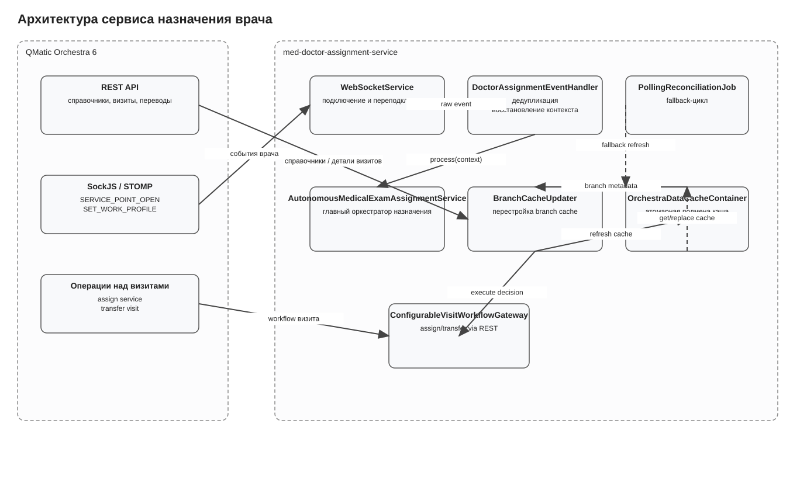
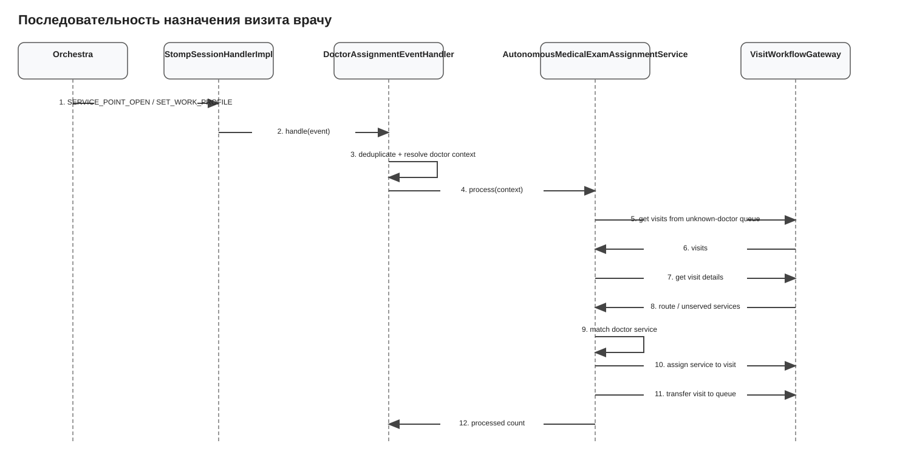
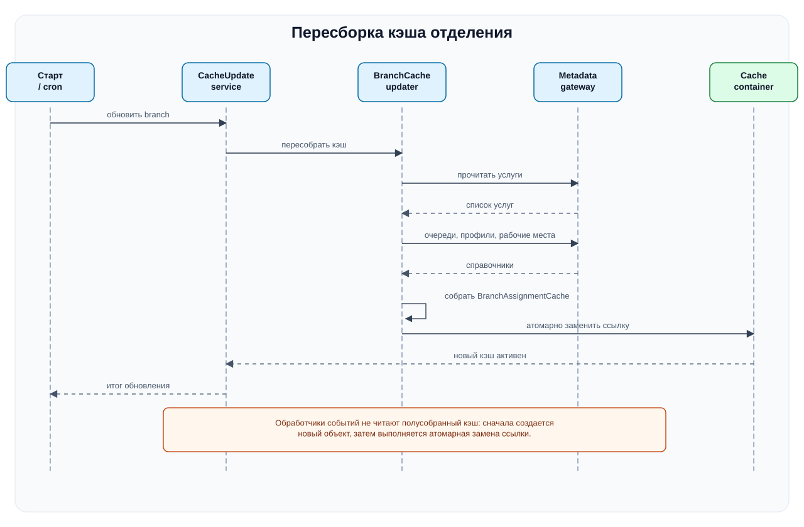
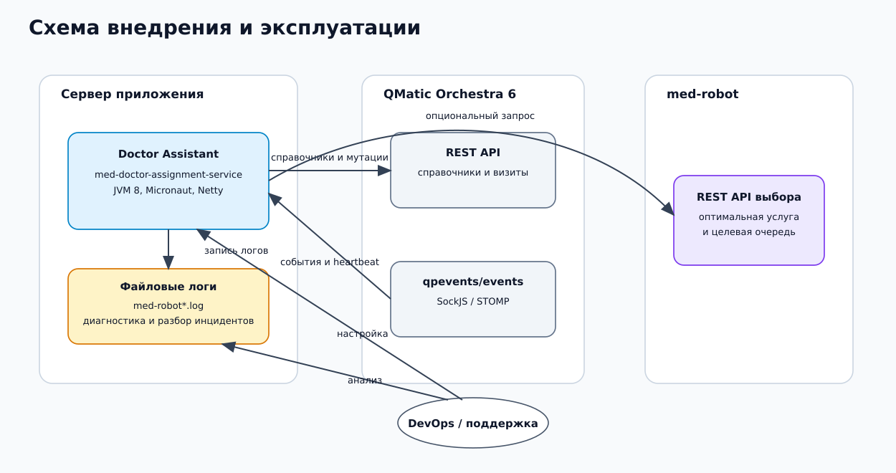

# Med Doctor Assignment Service

Сервис автоматически назначает визитам из очереди **«врач не назначен»** врача, который только что занял рабочее место в QMatic Orchestra 6, и переводит такие визиты в очередь соответствующей услуги. Решение ориентировано на сценарий **автономных медосмотров**, где критично быстро раздать визиты по реальным врачам без ручного вмешательства оператора.

## 1. Для чего нужен сервис

Типовой поток работы выглядит так:

1. Врач входит на service point.
2. Orchestra публикует событие `SERVICE_POINT_OPEN` или `SET_WORK_PROFILE`.
3. Сервис определяет branch, service point, врача и его work profile.
4. По кэшу справочников определяет, какие услуги врач может обслуживать.
5. Берет визиты из очереди «врач не назначен».
6. Анализирует непройденные услуги визита.
7. Выбирает лучшую услугу для этого врача.
8. Назначает услугу визиту и переводит визит в очередь услуги.

Сервис проектировался так, чтобы:

- не зависеть от GUI Orchestra;
- выдерживать повторные события и временные сетевые сбои;
- продолжать работу даже при отказе websocket-канала за счет polling fallback;
- не принимать решение на основе «живых» справочников при каждом событии, а работать через локальный branch cache.

## 2. Что входит в проект

### 2.1. Технологический стек

- Java 8
- Micronaut 3.5.2
- Maven
- Micronaut HTTP Client / Netty server
- Spring SockJS/STOMP client для подписки на события Orchestra
- Jackson для сериализации JSON

### 2.2. Структура пакетов

```text
src/main/java/com/qsystems/meddoctorassignment
├── adapter
│   ├── gateway            # абстракции интеграции
│   ├── gateway/impl       # REST-реализации gateway-слоя
│   ├── orchestra          # Micronaut client + вспомогательные утилиты
│   └── orchestra/dto      # DTO Orchestra
├── branchgetter           # стратегии выбора branch id для кэширования
├── cache                  # контейнер кэшей и пересборка branch cache
├── cache/model            # модели кэша
├── cache/service          # сервис управления жизненным циклом кэша
├── config                 # конфигурационные свойства
├── domain/model           # доменные модели визита и выбора услуги
├── domain/service         # доменные интерфейсы и оркестратор алгоритма
├── domain/service/impl    # реализации доменных интерфейсов
├── event                  # обработка входящих событий Orchestra
├── model/event            # нормализованное представление входящих событий
├── schedule               # polling fallback
├── util                   # технические утилиты устойчивости
└── websocket              # SockJS/STOMP клиент и разбор фреймов
```

## 3. Архитектура решения

### 3.0. PlantUML-диаграммы проекта

Ниже добавлены диаграммы в двух видах:

- исходники PlantUML: `docs/plantuml/*.puml`;
- заранее подготовленные SVG: `docs/diagrams/*.svg`.

Это позволяет:

- читать архитектуру прямо в `README.md` без внешних плагинов;
- редактировать диаграммы как код;
- использовать SVG в документации, wiki и при внедрении.

#### Общая архитектура сервиса



Исходник: `docs/plantuml/architecture-overview.puml`

#### Последовательность назначения визита врачу



Исходник: `docs/plantuml/assignment-sequence.puml`

#### Перестройка branch cache



Исходник: `docs/plantuml/cache-refresh-sequence.puml`

#### Схема внедрения и эксплуатации



Исходник: `docs/plantuml/deployment-view.puml`

### 3.1. Adapter layer

`OrchestraMetadataGateway` и `OrchestraMetadataGatewayImpl` отвечают за чтение справочных сущностей Orchestra:

- отделения;
- услуги;
- очереди;
- рабочие профили;
- точки обслуживания.

`VisitWorkflowGateway` отделен от чтения справочников, потому что операции над визитами в Orchestra часто зависят от конкретной инсталляции и набора доступных endpoint-ов. Для этого в проекте есть `ConfigurableVisitWorkflowGateway`, который читает пути из `application.yml`.

### 3.2. Cache layer

`BranchAssignmentCache` — центральная модель, в которой для одного отделения собирается весь справочный срез, нужный алгоритму.

Кэш содержит:

- `serviceId -> ServiceData`
- `serviceId -> queueId`
- `queueId -> serviceIds`
- `workProfileId -> queueIds`
- `servicePointId -> runtime state`
- `serviceExternalKey -> serviceId`
- `unknownDoctorQueueId`
- `lastUpdated`

`BranchCacheUpdater` строит новый экземпляр branch cache полностью, а затем `OrchestraDataCacheContainer` атомарно подменяет старый. Это важно для того, чтобы обработчик событий никогда не читал «полусобранный» кэш.

### 3.3. Event-driven слой

`WebSocketService` поднимает SockJS/STOMP подключение к Orchestra.

`StompSessionHandlerImpl` подписывается на события:

- `SERVICE_POINT_OPEN`
- `SET_WORK_PROFILE`

`WebsocketFrameHandler` превращает сырой JSON в `OrchestraEvent`, а `DoctorAssignmentEventHandler`:

1. определяет `TriggerSource`;
2. отбрасывает дубликаты через `EventDeduplicator`;
3. восстанавливает `DoctorContext`;
4. запускает доменный цикл назначения.

### 3.4. Domain layer

`AutonomousMedicalExamAssignmentService` — главный оркестратор алгоритма.

Он использует следующие расширяемые доменные абстракции:

- `LoggedDoctorContextResolver`
- `DoctorAvailableServicesResolver`
- `UnknownDoctorQueueVisitProvider`
- `VisitRouteAnalyzer`
- `DoctorServiceMatcher`
- `VisitAssignmentExecutor`

Благодаря этому бизнес-алгоритм можно дорабатывать локально, не переписывая websocket и кэширование.

### 3.5. Resilience layer

Для устойчивой работы добавлены:

- `BranchLockManager` — не допускает конкурентную обработку одного branch несколькими потоками;
- `EventDeduplicator` — подавляет повторы событий Orchestra;
- `ProcessedVisitRegistry` — предотвращает повторную обработку одного визита в коротком окне времени;
- `PollingReconciliationJob` — периодический fallback, если событие было потеряно или пришло в неудачный момент.

## 4. Алгоритм назначения

### 4.1. Восстановление doctor context

`DefaultLoggedDoctorContextResolver` сначала берет поля напрямую из event payload:

- `branchId`
- `servicePointId`
- `staffId` или `userId`
- `workProfileOrigId` или `workProfile`
- `workProfileName`
- `servicePointName`
- `userName` / `user`

Если часть полей отсутствует, включается fallback:

1. поиск по `servicePointId` в runtime cache branch;
2. поиск через `ServicePointContextGateway`;
3. поиск по `staffId` в runtime cache branch;
4. поиск по `staffId` через Orchestra.

Если после этого ключевые поля не заполнены, обработка события завершается исключением — это правильное поведение, потому что сервис не должен делать догадки в критическом workflow.

### 4.2. Определение доступных услуг врача

`DefaultDoctorAvailableServicesResolver` проходит по связке:

`workProfile -> queues -> services`

Итогом является множество `serviceId`, которые допустимы для текущего врача в рамках его текущего рабочего профиля.

### 4.3. Выбор услуги визита

`DefaultDoctorServiceMatcher` смотрит на `VisitDetails.unservedServices` и строит список кандидатов.

Правила выбора:

1. сначала учитывается `routeOrder` — приоритет имеет услуга, которая раньше стоит в маршруте визита;
2. если маршрут не задает явного преимущества, используется `service-priority-by-key` из конфигурации;
3. если и этого нет, применяется детерминированный fallback по `serviceId`.

Такая схема дает одновременно:

- предсказуемость;
- возможность ручной подстройки приоритетов;
- отсутствие случайного выбора.

### 4.4. Исполнение решения

`DefaultVisitAssignmentExecutor` делает три шага:

1. optional recheck — все ли еще визит находится в очереди «врач не назначен»;
2. вызов `assignServiceToVisit(...)`;
3. вызов `transferVisitToQueue(...)`;
4. optional post-check — действительно ли визит оказался в ожидаемой очереди.

При `dry-run=true` сервис только пишет в лог, какие действия он бы выполнил.

## 5. Подтвержденные и неподтвержденные API

### 5.1. Подтвержденные endpoint-ы

В проекте как подтвержденные используются:

- `/qsystem/rest/config/branches`
- `/rest/servicepoint/branches/{branchId}/services`
- `/rest/entrypoint/branches/{branchId}/services/{serviceId}/queue`
- `/rest/managementinformation/v2/branches/{branchId}/servicePoints`
- `/rest/servicepoint/branches/{branchId}/workProfiles`
- `/rest/servicepoint/branches/{branchId}/workProfiles/{workProfileId}/queues`
- `/rest/servicepoint/branches/{branchId}/queues/`

### 5.2. Конфигурируемые visit endpoint-ы

Пути для операций над визитами задаются в `application.assignment.experimental-endpoints`:

- `queue-visits-path`
- `visit-details-path`
- `visit-by-id-path`
- `assign-service-path`
- `transfer-visit-path`

Это сделано намеренно: код не должен «угадывать» приватные endpoint-ы Orchestra.

## 6. Конфигурация

Главный файл конфигурации — `src/main/resources/application.yml`.

### 6.1. Блок `application.orchestra`

Используется для:

- базового URL Orchestra;
- логина и пароля;
- base-path для REST;
- выбора отделений, для которых нужно строить кэш.

### 6.2. Блок `application.websocket`

Управляет event-driven интеграцией:

- включение / отключение websocket-подписки;
- STOMP topic;
- список событий;
- задержка переподключения.

### 6.3. Блок `application.assignment`

Управляет самим алгоритмом:

- включение сервиса;
- queue id очереди «врач не назначен»;
- ограничение визитов на цикл;
- polling cron;
- deduplication и processed TTL;
- режим `dry-run`;
- recheck перед переводом;
- список разрешенных branch;
- конфигурируемые приоритеты услуг;
- пути для visit workflow endpoint-ов.

## 7. Руководство для разработчиков

### 7.1. Сценарий локального запуска

```bash
mvn clean test
mvn mn:run
```

Либо собрать jar:

```bash
mvn clean package
java -jar target/med-doctor-assignment-service-*.jar
```

### 7.2. Что важно понимать при доработке

1. **Не смешивать доменную логику и транспорт.**
   Все нюансы websocket и REST должны оставаться в `websocket.*` и `adapter.*`.

2. **Не читать справочники Orchestra на каждый event без необходимости.**
   Для этого уже есть branch cache.

3. **Не принимать решение без полного doctor context.**
   Лучше завершить обработку ошибкой и записать понятный лог, чем назначить неверного врача.

4. **Не убирать recheck/post-check без явной причины.**
   Эти шаги защищают от гонок между несколькими источниками обработки.

5. **Не встраивать hardcode приватных endpoint-ов Orchestra в доменный код.**
   Все пути для визитов должны оставаться конфигурируемыми.

### 7.3. Главные точки расширения

- новая логика сопоставления услуг — `DoctorServiceMatcher`
- новый способ вычисления доступных врачу услуг — `DoctorAvailableServicesResolver`
- новая реализация workflow над визитом — `VisitWorkflowGateway`
- дополнительные триггеры — `DoctorAssignmentEventHandler`
- особая логика fallback lookup — `LoggedDoctorContextResolver`

### 7.4. Что смотреть при ошибке `500` на assign-service

Если в логах виден `500` на `POST /rest/entrypoint/.../visits/{visitId}/services/{serviceId}/`, нужно проверить:

- соответствует ли endpoint конкретной инсталляции Orchestra;
- допустима ли смена услуги для данного состояния визита;
- не завершена ли текущая услуга визита;
- не требуется ли иной payload для назначения услуги;
- не ожидает ли Orchestra другой source id / entrypoint id / queue id;
- не конфликтует ли смена услуги с текущей очередью визита;
- не было ли race condition, из-за которого визит уже ушел из очереди «врач не назначен».

## 8. Руководство для технической поддержки

### 8.1. На что смотреть в логах

Основные контрольные сообщения:

- `Refresh caches for configured branches ...`
- `Start cache refresh for branch ...`
- `Finish cache refresh for branch ...`
- `Connecting to Orchestra websocket ...`
- `Subscribed to ...`
- `Start assignment cycle ...`
- `Doctor ... available services=...`
- `Visits in unknown-doctor queue ... count=...`
- `Visit ... matchFound=true ... success=...`
- `Finish assignment cycle ... processed=...`

### 8.2. Типовые симптомы и интерпретация

**Симптом:** кэш не прогревается.  
Проверить доступность REST endpoint-ов справочников и корректность `branches-for-cache`.

**Симптом:** websocket не подключается.  
Проверить `/qpevents/events/info`, логин/пароль, сетевую доступность, reverse proxy и heartbeat.

**Симптом:** сервис видит врача, но не назначает визиты.  
Проверить:

- `unknown-doctor-queue-id`
- `workProfile -> queues`
- `queue -> services`
- наличие непройденных услуг у визитов
- совпадение service id/external key

**Симптом:** сервис пытается назначить услугу, но получает `500`.  
Проверить правильность visit endpoint-ов и допустимость операции на стороне Orchestra.

### 8.3. Минимальный набор данных для разбора инцидента

При эскалации разработчику нужно приложить:

- branch id;
- service point id;
- staff id;
- work profile id;
- visit id;
- полный URL проблемного endpoint-а;
- тело запроса;
- тело ответа Orchestra;
- фрагмент лога от `Start assignment cycle` до ошибки.

## 9. Руководство по внедрению

Перед вводом в эксплуатацию нужно подтвердить:

1. queue id очереди «врач не назначен» для каждого отделения;
2. корректность mapping `service -> queue`;
3. корректность mapping `workProfile -> queues`;
4. факт публикации событий `SERVICE_POINT_OPEN` и `SET_WORK_PROFILE`;
5. рабочие endpoint-ы для:
   - чтения визитов очереди,
   - чтения визита по id,
   - чтения детального маршрута,
   - назначения услуги,
   - перевода визита;
6. возможность авторизации под сервисной учетной записью.

### 9.1. Рекомендуемый порядок внедрения

1. Запустить сервис с `dry-run=true`.
2. Проверить кэш и websocket.
3. Проверить, что врачи распознаются корректно.
4. Проверить, какие услуги выбираются для визитов.
5. Согласовать реальные visit endpoint-ы.
6. Включить `dry-run=false` сначала на тестовом отделении.
7. После подтверждения корректности постепенно расширять список `allowed-branches`.

## 10. Руководство для DevOps

### 10.1. Сетевые зависимости

Сервису нужен исходящий доступ:

- к Orchestra REST API;
- к `/qpevents/events`;
- к `/qpevents/events/info`;
- к XHR streaming / XHR send endpoint-ам SockJS.

### 10.2. Runtime endpoint-ы самого сервиса

Micronaut поднимает сервер на `micronaut.server.port`, по умолчанию в проекте — `8085`.

Также доступны management endpoint-ы Micronaut, если они включены настройками/дефолтами окружения:

- `/health`
- `/info`
- `/beans`
- `/routes`
- `/threaddump`
- `/refresh`

### 10.3. Что важно для эксплуатации

- сервис не хранит состояние в БД;
- кэш полностью в памяти процесса;
- при рестарте кэш будет перестроен заново;
- при недоступности websocket сервис продолжит работу через polling fallback;
- при недоступности REST Orchestra сервис не сможет прогревать кэш и выполнять назначение.

### 10.4. Логирование

Для production желательно явно задать уровни логирования:

- `INFO` — штатная эксплуатация;
- `DEBUG` — диагностика интеграционных проблем и проблемных payload;
- при необходимости отдельно поднять DEBUG для:
  - `com.qsystems.meddoctorassignment`
  - `io.micronaut.http.client`
  - `org.springframework.web.socket`

### 10.5. Рекомендации по конфигурированию

- учетные данные Orchestra лучше подавать через переменные окружения или секреты, а не хранить в git;
- список `allowed-branches` использовать как предохранитель при поэтапном rollout;
- `dry-run=true` применять при первичной проверке конфигурации;
- `stale-cache-duration-seconds` не делать слишком маленьким, иначе возрастет нагрузка на Orchestra;
- `event-deduplication-ttl-seconds` и `processed-visit-ttl-seconds` подбирать под реальную частоту событий.

## 11. Тесты

В проекте есть модульные и интеграционные тесты для ключевых частей алгоритма:

- дедупликация событий;
- branch-level lock;
- сопоставление услуг врачу;
- восстановление doctor context;
- JSON mapping визитов;
- интеграционный сценарий `SET_WORK_PROFILE`.

Тесты используют in-memory/fake gateway-реализации и подтверждают доменную логику независимо от реальной Orchestra.

## 12. Краткий чек-лист перед production

- [ ] Подтверждены branch id для rollout
- [ ] Подтвержден `unknown-doctor-queue-id`
- [ ] Подтверждены все visit endpoint-ы
- [ ] Проверен websocket-доступ к `/qpevents/events`
- [ ] Проверен прогрев branch cache
- [ ] Проверен `dry-run` сценарий на тестовом отделении
- [ ] Подтвержден корректный выбор услуг врачам
- [ ] Подтвержден успешный перевод визита в реальную очередь
- [ ] Настроены уровни логирования и сбор логов
- [ ] Учетные данные Orchestra вынесены в безопасное хранилище
