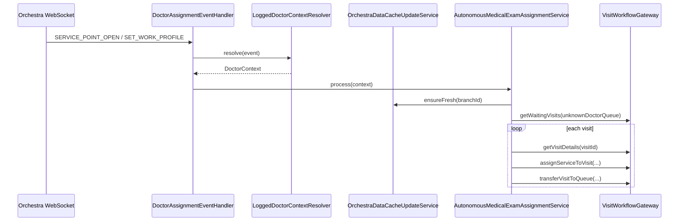

# Med Doctor Assignment Service

Служба реализует автоматическое назначение визитам из очереди **«врач не назначен»** услуги врача, который начал работу на service point, для сценария автономных медосмотров в QMatic Orchestra 6.

## Что сделано

Проект построен как отдельный Java 8 + Micronaut + Maven сервис и повторяет подтвержденные подходы из `med-robot`:

- `OrchestraRestClient` как Micronaut `@Client`
- `RestUtils.handleReactiveResponseWithBlock(...)`
- `OrchestraDataCacheContainer`
- `BranchCacheUpdater`
- `OrchestraDataCacheUpdateService`
- `WebSocketService`
- `StompSessionHandlerImpl`
- `WebsocketFrameHandler`
- `OrchestraEvent`
- `BranchGettingStrategy`, `AllBranchesGetter`, `DefinedBranchesGetter`

## Ключевая трактовка событий

В этом сервисе:

- `SERVICE_POINT_OPEN` считается событием логина сотрудника / начала работы врача.
- Контекст врача (`branchId`, `servicePointId`, `staffId`, `workProfileId`) в первую очередь извлекается **прямо из payload `SERVICE_POINT_OPEN`**.
- `SET_WORK_PROFILE` используется как дополнительный триггер повторной обработки.
- Если часть данных в событии отсутствует, сервис добирает недостающий context через fallback lookup по service point / staff.

Эта логика основана на фактическом формате событий, встречающемся в приложенном `med-robot`: в логах присутствуют поля `branchId`, `userId`, `workProfileOrigId`, `workProfileName`, `servicePointName`, а `unitId` соответствует service point id.

## Архитектура

### 1. Adapter / client layer

Пакеты:

- `adapter.orchestra.*`
- `adapter.gateway.*`

Компоненты:

- `OrchestraRestClient` — подтвержденные REST-вызовы Orchestra
- `OrchestraMetadataGatewayImpl` — работа с branches / services / queues / work profiles / service points
- `ServicePointContextGatewayImpl` — fallback lookup service point context
- `ConfigurableVisitWorkflowGateway` — адаптер для операций над визитами через **конфигурируемые** endpoint-ы

### 2. Cache layer

Пакеты:

- `cache.*`
- `cache.model.*`

Компоненты:

- `OrchestraDataCacheContainer`
- `BranchAssignmentCache`
- `ServicePointRuntimeState`
- `BranchCacheUpdater`
- `OrchestraDataCacheUpdateService`

Содержимое branch cache:

- `workProfileId -> queueIds`
- `serviceId -> simpleQueueId`
- `queueId -> serviceIds`
- `servicePointId -> current workProfileId / staffId / status`
- `unknownDoctorQueueId` — ID очереди "врач не назначен", задается только числовым идентификатором
- `serviceExternalKey -> serviceId`

### 3. Event layer

Пакеты:

- `event.*`
- `websocket.*`
- `model.event.*`

Компоненты:

- `DoctorAssignmentEventHandler`
- `WebsocketFrameHandler`
- `StompSessionHandlerImpl`
- `WebSocketService`
- `EventDeduplicator`

### 4. Domain layer

Пакеты:

- `domain.service.*`
- `domain.service.impl.*`
- `domain.model.*`

Компоненты:

- `LoggedDoctorContextResolver`
- `DoctorAvailableServicesResolver`
- `UnknownDoctorQueueVisitProvider`
- `VisitRouteAnalyzer`
- `DoctorServiceMatcher`
- `VisitAssignmentExecutor`
- `AutonomousMedicalExamAssignmentService`

### 5. Scheduling / resilience

- `PollingReconciliationJob` — fallback polling
- `BranchLockManager` — branch-level lock
- `ProcessedVisitRegistry` — защита от повторной обработки визитов

## Алгоритм

1. Сервис получает `SERVICE_POINT_OPEN` или `SET_WORK_PROFILE`.
2. Из события извлекается doctor context.
3. При необходимости недостающие данные добираются из fallback adapter.
4. Обеспечивается свежесть branch cache.
5. Для текущего work profile строится список доступных врачу услуг.
6. Находится очередь «врач не назначен».
7. Получаются визиты, ожидающие в этой очереди.
8. Для каждого визита читается маршрут / непройденные услуги.
9. Выбирается подходящая врачу услуга:
   - сначала по порядку в маршруте,
   - затем по конфигурируемому приоритету,
   - затем по минимальному `serviceId`.
10. Выполняется назначение услуги и перевод визита в очередь услуги.
11. Цикл ограничивается `max-visits-per-cycle`.

## Последовательность



## Подтвержденные endpoint-ы и факты

### Подтверждено кодом `med-robot`

Из исходного проекта подтверждены и переиспользованы следующие endpoint-ы:

- `${application.orchestra.configuration-rest-path}/branches`
- `${application.orchestra.common-rest-path}/servicepoint/branches/{branchId}/services`
- `${application.orchestra.common-rest-path}/entrypoint/branches/{branchId}/services/{serviceId}/queue`
- `${application.orchestra.common-rest-path}/managementinformation/v2/branches/{branchId}/servicePoints`
- `${application.orchestra.common-rest-path}/servicepoint/branches/{branchId}/workProfiles`
- `${application.orchestra.common-rest-path}/servicepoint/branches/{branchId}/workProfiles/{workProfileId}/queues`
- `${application.orchestra.common-rest-path}/servicepoint/branches/{branchId}/queues/`

### Подтверждено открытыми материалами

- В Orchestra есть Central WebSocket Server Settings, включая heartbeat и параметры WebSocket / Secure WebSocket, что подтверждает корректность event-driven подписки.  
- Queue IDs можно получать через `/qsystem/rest/servicepoint/branches/<branch ID>/queues/`.  
- Web Service Point поддерживает multi-service сценарии и transfer в queue / staff pool / counter pool.  
- В Data Connect `VisitTransactionOutcome` содержит `TRANSFER_TO_QUEUE`, `TRANSFER_TO_SERVICE_POINT`, `TRANSFER_TO_STAFF`.  
- При добавлении услуги ее необходимо добавить в queuing profile или profiles, поэтому связь `workProfile -> queues -> services` должна учитываться в кэше.

### Что намеренно не зафиксировано как «точно известное»

Точные REST endpoint-ы для следующих операций **не подтверждены** ни кодом `med-robot`, ни приложенными открытыми материалами:

- получить список визитов в очереди «врач не назначен»
- прочитать маршрут визита / непройденные услуги
- назначить визиту услугу врача
- перевести визит в очередь услуги

Поэтому эти операции вынесены в `VisitWorkflowGateway`.

## Production caveat по VisitWorkflowGateway

В проекте есть `ConfigurableVisitWorkflowGateway`. Он не «угадывает» приватные endpoint-ы Orchestra.

Он работает только если явно задать:

```yaml
application:
  assignment:
    experimental-endpoints:
      enabled: true
      queue-visits-path: /your/path/for/queue/{queueId}/visits
      visit-details-path: /your/path/for/visits/{visitId}
      visit-by-id-path: /your/path/for/visits/{visitId}
      assign-service-path: /your/path/for/visit/assign-service
      transfer-visit-path: /your/path/for/visit/transfer
```

Для перевода визита в очередь в Orchestra важен еще один нюанс:

- поле `fromId` в теле запроса — это **логический номер Entry Point**, а не `queueId`;
- поэтому для production нужно явно задать `application.assignment.source-entry-point-id-by-branch`;
- при отсутствии настройки сервис теперь завершает операцию с понятной ошибкой конфигурации, а не с неочевидным `500` от Orchestra.

Итог:

- domain workflow завершен;
- event/caching/resilience завершены;
- интеграционные тесты используют fake gateway;
- production mapping для visit operations нужно сверить с реальной инсталляцией Orchestra 6.

## Конфигурация

```yaml
application:
  orchestra:
    url: http://localhost:8080
    username: orchestra-user
    password: orchestra-password
    common-rest-path: /rest
    configuration-rest-path: /qsystem/rest/config
    branches-for-cache: "*"

  websocket:
    topic: /topic/event
    subscribed-events:
      - SERVICE_POINT_OPEN
      - SET_WORK_PROFILE
    delay-before-reconnect-in-milliseconds: 10000

  assignment:
    enabled: true
    unknown-doctor-queue-id: 0
    max-visits-per-cycle: 50
    polling-cron: "0 */5 * * * ?"
    branch-lock-timeout-ms: 5000
    dry-run: true
    recheck-visit-before-transfer: true
    allowed-branches: []
    stale-cache-duration-seconds: 300
    event-deduplication-ttl-seconds: 120
    processed-visit-ttl-seconds: 900
    service-priority-by-key: {}
    # fromId при переводе визита = логический номер Entry Point
    default-source-entry-point-id: 1
    source-entry-point-id-by-branch:
      6: 1
```

## Логирование

Сервис пишет:

- старт / конец цикла
- trigger source
- `branchId`, `servicePointId`, `staffId`, `workProfileId`
- источники заполнения контекста: из события или fallback lookup
- список доступных врачу услуг
- количество визитов в очереди «врач не назначен»
- результат по каждому визиту
- ошибки websocket / REST / assignment
- действия dry-run режима

## Тесты

Реализованы тесты на:

- извлечение контекста из `SERVICE_POINT_OPEN`
- fallback при частично заполненном payload
- matching услуг врача с route order / priority / fallback
- дедупликацию событий
- branch locking
- пустую очередь
- отсутствие подходящих услуг
- успешное назначение / перевод
- повторную обработку
- сценарий `SET_WORK_PROFILE`
- частичную недоступность downstream операций

## Сборка

```bash
mvn clean test
mvn clean package
```

## Дальнейшие шаги в целевом контуре

1. Сверить реальные endpoint-ы visit operations.
2. Уточнить body/response контракт для assign/transfer.
3. Подключить production endpoint-ы в `application.assignment.experimental-endpoints`.
4. Переключить `dry-run` в `false`.
5. Провести end-to-end тест на тестовом branch.
